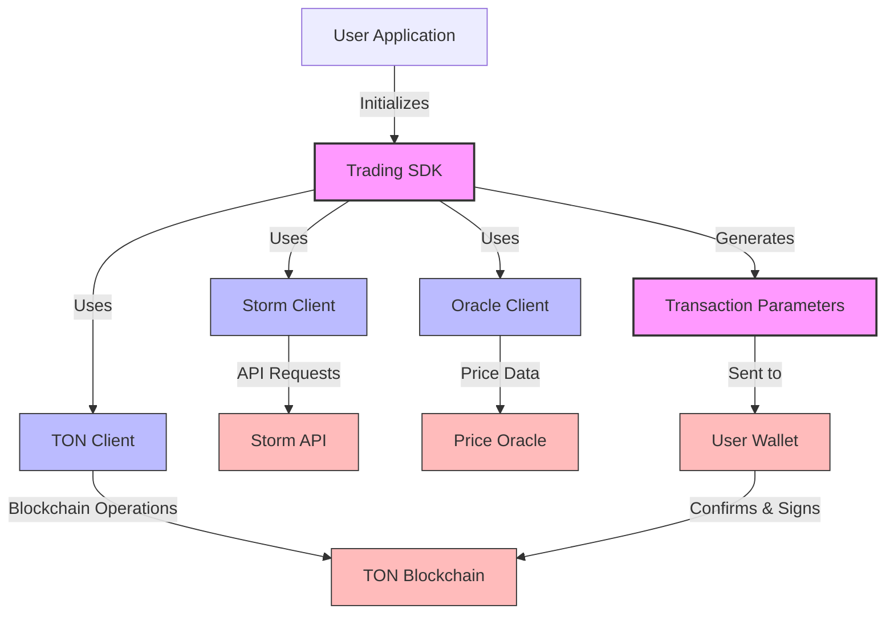
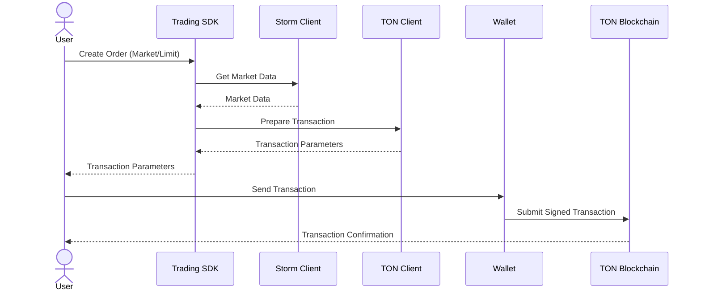
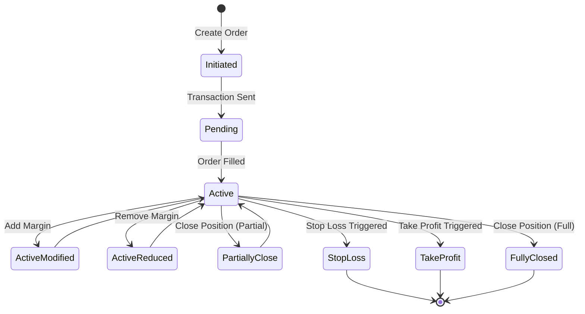
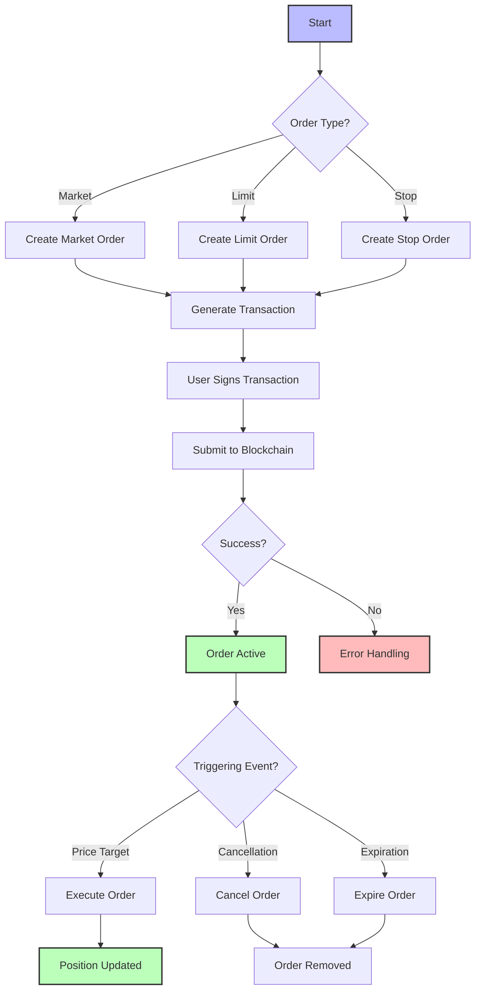

# Architecture & Flows

## SDK Component Architecture

```mermaid
graph TD
    User[User Application] -->|Initializes| SDK[Trading SDK]
    SDK -->|Uses| SC[Storm Client]
    SDK -->|Uses| TC[TON Client]
    SDK -->|Uses| OC[Oracle Client]
    
    SC -->|API Requests| StormAPI[Storm API]
    TC -->|Blockchain Operations| TON[TON Blockchain]
    OC -->|Price Data| Oracle[Price Oracle]
    
    SDK -->|Generates| TX[Transaction Parameters]
    TX -->|Sent to| Wallet[User Wallet]
    Wallet -->|Confirms & Signs| TON
    
    classDef primary fill:#f9f,stroke:#333,stroke-width:2px;
    classDef secondary fill:#bbf,stroke:#333,stroke-width:1px;
    classDef external fill:#fbb,stroke:#333,stroke-width:1px;
    
    class SDK,TX primary;
    class SC,TC,OC secondary;
    class StormAPI,TON,Oracle,Wallet external;
```

## Order Creation Flow

```mermaid
sequenceDiagram
    actor User
    participant SDK as Trading SDK
    participant SC as Storm Client
    participant TC as TON Client
    participant Wallet
    participant Blockchain as TON Blockchain
    
    User->>SDK: Create Order (Market/Limit)
    SDK->>SC: Get Market Data
    SC-->>SDK: Market Data
    
    SDK->>TC: Prepare Transaction
    TC-->>SDK: Transaction Parameters
    
    SDK-->>User: Transaction Parameters
    User->>Wallet: Send Transaction
    Wallet->>Blockchain: Submit Signed Transaction
    Blockchain-->>User: Transaction Confirmation
```

## Position Lifecycle

```mermaid
stateDiagram-v2
    [*] --> Initiated: Create Order
    Initiated --> Pending: Transaction Sent
    Pending --> Active: Order Filled
    
    Active --> ActiveModified: Add Margin
    ActiveModified --> Active
    
    Active --> ActiveReduced: Remove Margin
    ActiveReduced --> Active
    
    Active --> PartiallyClose: Close Position (Partial)
    PartiallyClose --> Active
    
    Active --> StopLoss: Stop Loss Triggered
    Active --> TakeProfit: Take Profit Triggered
    Active --> FullyClosed: Close Position (Full)
    
    StopLoss --> [*]
    TakeProfit --> [*]
    FullyClosed --> [*]
```

## Transaction Processing Flow

```mermaid
flowchart TD
    A[Start] --> B{Order Type?}
    B -->|Market| C[Create Market Order]
    B -->|Limit| D[Create Limit Order]
    B -->|Stop| E[Create Stop Order]
    
    C --> F[Generate Transaction]
    D --> F
    E --> F
    
    F --> G[User Signs Transaction]
    G --> H[Submit to Blockchain]
    H --> I{Success?}
    
    I -->|Yes| J[Order Active]
    I -->|No| K[Error Handling]
    
    J --> L{Triggering Event?}
    L -->|Price Target| M[Execute Order]
    L -->|Cancellation| N[Cancel Order]
    L -->|Expiration| O[Expire Order]
    
    M --> P[Position Updated]
    N --> Q[Order Removed]
    O --> Q
    
    style A fill:#bbf,stroke:#333,stroke-width:2px
    style J fill:#bfb,stroke:#333,stroke-width:2px
    style P fill:#bfb,stroke:#333,stroke-width:2px
    style K fill:#fbb,stroke:#333,stroke-width:2px
```